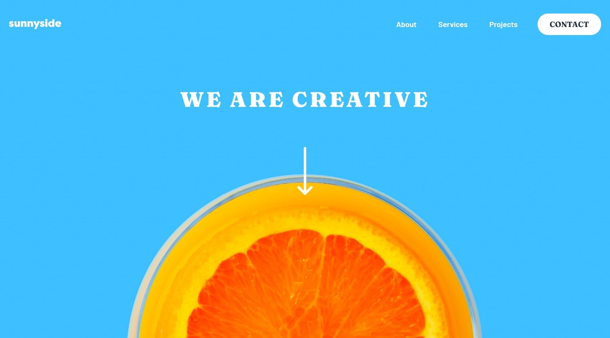

# Frontend Mentor - Sunnyside agency landing page solution

This is a solution to the [Sunnyside agency landing page challenge on Frontend Mentor](https://www.frontendmentor.io/challenges/sunnyside-agency-landing-page-7yVs3B6ef). Frontend Mentor challenges help you improve your coding skills by building realistic projects.

## Table of contents

- [Overview](#overview)
  - [The challenge](#the-challenge)
  - [Screenshot](#screenshot)
  - [Links](#links)
- [My process](#my-process)
  - [Built with](#built-with)
  - [What I learned](#what-i-learned)
  - [Continued development](#continued-development)
  - [Useful resources](#useful-resources)
- [Author](#author)
- [Acknowledgments](#acknowledgments)

## Overview

### The challenge

Users should be able to:

- View the optimal layout for the site depending on their device's screen size
- See hover states for all interactive elements on the page

### Screenshot



### Links

- Solution URL: [Add solution URL here](https://your-solution-url.com)
- Live Site URL: [Add live site URL here](https://godm0de.github.io/Sunnyside-agency-landing-page/)

## My process

### Built with

- Semantic HTML5 markup
- Mobile-first workflow
- BEMIT (ITCSS & BEM)
- SASS with scss syntax
- Layouts without media queries (Grid containers)
- Atomic design components

### What I learned

I use this project to learn some layouts without media queries, something that could be pretty tricky but really joyful.

I use different math expressions in css to control columns number and the wrap moment:

```scss
 grid-template-columns: repeat(
        auto-fit,
        minmax(clamp(100%/ (2 + 1) + 0.1%, (#{layout.$md-bp} - 100vw) * 1000, 100%), 1fr)
    );
```

```scss
flex: max(375px, 50%);
```

### Continued development

I used this Atomic design mixed with a BEMIT method for this project. Sometimes the fact of apply this methodology could be hard beacuse when the design project is not really defined that way, i gotta figure out wich component belongs to which group (Atoms, molecules and organisms). I would love to keep improving in that!

### Useful resources

- [Dev to](https://dev.to/afif/build-your-responsive-website-without-media-query-omj) - This website really helps me to find out common solutions to layouts without media queries.
- [Uxpin](https://www.uxpin.com/studio/blog/atomic-ui-components/) - Sometimes i check out this website to refresh atomic design.

## Author

- Frontend Mentor - [@Godm0de](https://www.frontendmentor.io/profile/Godm0de)

## Acknowledgments

I thing this project is perfect to build a solid responsive landing page.